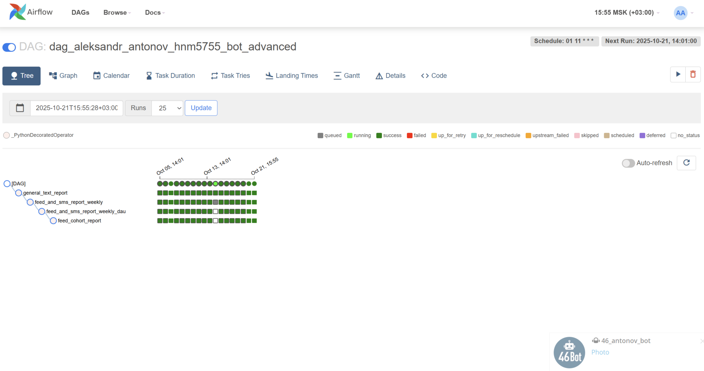
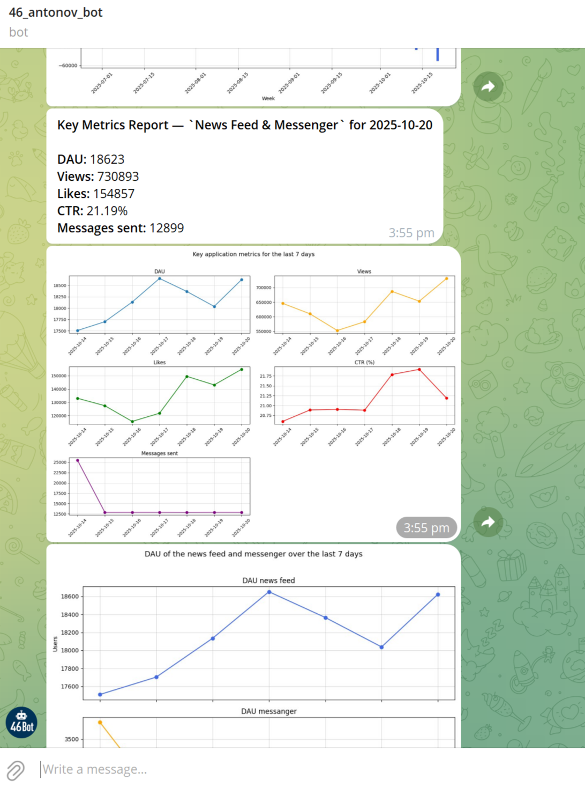

# Telegram Metrics Report Bot

### 🧩 Overview
This project implements an **automated Telegram bot** that sends daily and weekly dashboards with key product metrics from a mobile application.

The bot connects to a ClickHouse database, retrieves data about user activity in both the **news feed** and **messenger**, calculates core engagement metrics, and visualizes them as time-series charts.  
Reports are automatically sent to Telegram — either to a **private chat** or a **group/channel**.
All steps (extract → transform → visualize → send) are orchestrated by a single Airflow DAG. No manual runs needed.

---

### DAG Description
The DAG `dag_aleksandr_antonov_hnm5755_bot_advanced` runs **daily at 11:01 (MSK)** and executes four sequential tasks:

1. **general_text_report** — sends a text message to Telegram with the previous day's key metrics:  
   - Daily Active Users (DAU);  
   - Views;  
   - Likes;  
   - CTR (%);  
   - Messages sent.

2. **feed_and_sms_report_weekly** — builds a 7-day dashboard visualizing:  
   - DAU;  
   - Views;  
   - Likes;  
   - CTR;  
   - Messages sent.

3. **feed_and_sms_report_weekly_dau** — creates a separate 7-day visualization comparing DAU dynamics in:  
   - News feed;  
   - Messenger.

4. **feed_cohort_report** — performs a *weekly cohort analysis* showing user retention and churn between weeks (new, retained, gone users).

---

### Schedule & Configuration

| Parameter | Value |
|------------|--------|
| **Owner** | `aleksandr_antonov_hnm5755` |
| **Start Date** | `2025-10-02` |
| **Schedule Interval** | `01 11 * * *` |
| **Retries** | 1 |
| **Retry Delay** | 5 minutes |
| **Database** | ClickHouse (simulator_20250820) |

---

### DAG Visualization

Below is the execution tree of the DAG in **Airflow**.  
Each green square represents a successful daily run:

---

### Example Reports

#### Weekly Cohort Analysis
Shows how many users remained active ('retained'), dropped out ('gone'), or appeared for the first time ('new'):

---

#### Key Metrics Dashboard (7 days)
Aggregated time-series of the main application metrics:

---

#### DAU Trends
Comparison of daily active users in **news feed** and **messenger**:

---

#### Telegram Bot Output
Example of the automated report sent directly to Telegram:

---

### ⚙️ Tools & Technologies

---

### Usage
All materials are provided for reference and demonstration purposes.  
Database connections and Airflow runtime are **not required** to explore the project.

To review:
1. Open **`dag_aleksandr_antonov_hnm5755_bot_advanced.py`** — full DAG logic and dependencies.  
2. View **`bot_advanced_airflow.png`** to see the DAG execution tree.  
3. Explore report examples in `.jpg` and `.png` files for visual outputs.  
4. No code execution is necessary — the project illustrates structure, dependencies, and ETL design.

---

### 📂 Repository structure

- dag_aleksandr_antonov_hnm5755_bot_advanced.py                 # Airflow DAG code.  
- bot_advanced_airflow.png                                      # Airflow Tree View (execution graph).  
- Weekly cohort analysis of news feed users.jpg                 # Weekly cohort analysis visualization.  
- Key application metrics for the last 7 days.jpg               # 7-day metrics chart.  
- DAU of the news feed and messenger over the last 7 days.jpg   # DAU comparison chart.  
- report_text.png                                               # Telegram report screenshot.  
- README.md                                                     # Project documentation.  

---

### Author
**Aleksandr Antonov**  
📊 Product & Data Analyst  
🎓 [Karpov.Courses — Data Analyst Simulator](https://karpov.courses)

---
